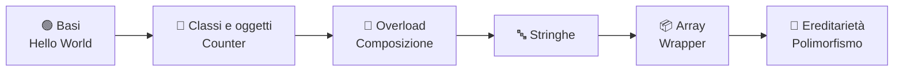

<div align="center">

# ☕ Linguaggi di Programmazione

### Il mio percorso in **Java** durante il corso dell'**Università degli Studi di Ferrara**

[](https://www.oracle.com/java/technologies/downloads/)
[](https://www.unife.it/)
[](#-roadmap)
[](https://github.com/MatteoBeccari05/Linguaggi_di_programmazione/commits/main)
[](https://github.com/MatteoBeccari05/Linguaggi_di_programmazione/stargazers)

*Dall'«Hello World!» al polimorfismo: esercizi, esperimenti e appunti in codice.*

[📂 Struttura](#-struttura-della-repository) •
[🧠 Argomenti](#-argomenti-trattati) •
[🚀 Come eseguire](#-come-compilare-ed-eseguire-il-codice) •
[🗺️ Roadmap](#-roadmap) •
[👤 Autore](#-autore)

</div>

---

## 📖 Introduzione

Questa repository raccoglie tutti i programmi e gli esercizi in **Java** sviluppati durante il corso di **Linguaggi di Programmazione**. Ogni cartella corrisponde a una lezione e aggiunge un tassello al percorso: si parte dalle basi della sintassi e si arriva ai pilastri della **programmazione orientata agli oggetti**.

Può essere utile come:

- 📝 **archivio personale** degli esercizi svolti;
- 🔎 **riferimento rapido** per ripassare un concetto prima dell'esame;
- 🤝 **spunto di confronto** per chi segue lo stesso corso.

> [!NOTE]
> Il codice è scritto a scopo didattico: la priorità è la chiarezza, non l'ottimizzazione.

---

## 📂 Struttura della Repository

<!-- STRUCTURE:START -->

 

| | Cartella | Argomento | Concetti chiave | File | |
|:-:|----------|-----------|-----------------|:----:|:-:|
| 🟢 | **Lezione_1** | Concetti introduttivi (Hello World!) | `sintassi` `main` `compilazione` |  | [](https://github.com/MatteoBeccari05/Linguaggi_di_programmazione/tree/main/Lezione_1) |
| 🧱 | **Lezione_2** | Primi esercizi con classe Counter | `classi` `campi` `metodi` `costruttori` |  | [](https://github.com/MatteoBeccari05/Linguaggi_di_programmazione/tree/main/Lezione_2) |
| 🔁 | **Lezione_3** | Esercizi su overload ed oggetti composti | `overload` `composizione` `riferimenti` |  | [](https://github.com/MatteoBeccari05/Linguaggi_di_programmazione/tree/main/Lezione_3) |
| 🔤 | **Lezione_4** | Esercizi sulle stringhe | `String` `immutabilità` `manipolazione` |  | [](https://github.com/MatteoBeccari05/Linguaggi_di_programmazione/tree/main/Lezione_4) |
| 📦 | **Lezione_5** | Esercizi sugli array e sui wrapper | `array` `wrapper` `autoboxing` |  | [](https://github.com/MatteoBeccari05/Linguaggi_di_programmazione/tree/main/Lezione_5) |
| 🧬 | **Lezione_6** | Esercizi su ereditarietà e polimorfismo | `extends` `overriding` `polimorfismo` |  | [](https://github.com/MatteoBeccari05/Linguaggi_di_programmazione/tree/main/Lezione_6) |
| 🎓 | **Tutorato** | Esercizi svolti durante i tutorati | `ripasso` `esercizi` |  | [](https://github.com/MatteoBeccari05/Linguaggi_di_programmazione/tree/main/Tutorato) |
| 📄 | **somma.java** | File nella root | — |  | [](https://github.com/MatteoBeccari05/Linguaggi_di_programmazione/blob/main/somma.java) |

#### 🔎 Esplora i file

<details>
<summary>🟢 <b>Lezione_1</b> — 2 file</summary>

- [`Hello.java`](https://github.com/MatteoBeccari05/Linguaggi_di_programmazione/blob/main/Lezione_1/Hello.java)
- [`lettura.java`](https://github.com/MatteoBeccari05/Linguaggi_di_programmazione/blob/main/Lezione_1/lettura.java)

</details>

<details>
<summary>🧱 <b>Lezione_2</b> — 10 file</summary>

- [`esempio_due_file/Counter.java`](https://github.com/MatteoBeccari05/Linguaggi_di_programmazione/blob/main/Lezione_2/esempio_due_file/Counter.java)
- [`metodo_decremento/Counter.java`](https://github.com/MatteoBeccari05/Linguaggi_di_programmazione/blob/main/Lezione_2/metodo_decremento/Counter.java)
- [`costruttori_multipli/Counter.java`](https://github.com/MatteoBeccari05/Linguaggi_di_programmazione/blob/main/Lezione_2/costruttori_multipli/Counter.java)
- [`metodi_equal_copy/Counter.java`](https://github.com/MatteoBeccari05/Linguaggi_di_programmazione/blob/main/Lezione_2/metodi_equal_copy/Counter.java)
- [`esempi_un_file/Esempio2.java`](https://github.com/MatteoBeccari05/Linguaggi_di_programmazione/blob/main/Lezione_2/esempi_un_file/Esempio2.java)
- [`esempio_due_file/Esempio.java`](https://github.com/MatteoBeccari05/Linguaggi_di_programmazione/blob/main/Lezione_2/esempio_due_file/Esempio.java)
- [`metodo_decremento/Esempio.java`](https://github.com/MatteoBeccari05/Linguaggi_di_programmazione/blob/main/Lezione_2/metodo_decremento/Esempio.java)
- [`esempi_un_file/Esempio.java`](https://github.com/MatteoBeccari05/Linguaggi_di_programmazione/blob/main/Lezione_2/esempi_un_file/Esempio.java)
- [`costruttori_multipli/Esempio.java`](https://github.com/MatteoBeccari05/Linguaggi_di_programmazione/blob/main/Lezione_2/costruttori_multipli/Esempio.java)
- [`metodi_equal_copy/Esempio.java`](https://github.com/MatteoBeccari05/Linguaggi_di_programmazione/blob/main/Lezione_2/metodi_equal_copy/Esempio.java)

</details>

<details>
<summary>🔁 <b>Lezione_3</b> — 5 file</summary>

- [`Overload/Counter.java`](https://github.com/MatteoBeccari05/Linguaggi_di_programmazione/blob/main/Lezione_3/Overload/Counter.java)
- [`Oggetti_Composti/Esempio_orologio/Counter.java`](https://github.com/MatteoBeccari05/Linguaggi_di_programmazione/blob/main/Lezione_3/Oggetti_Composti/Esempio_orologio/Counter.java)
- [`Overload/Esempio.java`](https://github.com/MatteoBeccari05/Linguaggi_di_programmazione/blob/main/Lezione_3/Overload/Esempio.java)
- [`Oggetti_Composti/Esempio_orologio/EsempioOrologio.java`](https://github.com/MatteoBeccari05/Linguaggi_di_programmazione/blob/main/Lezione_3/Oggetti_Composti/Esempio_orologio/EsempioOrologio.java)
- [`Oggetti_Composti/Esempio_orologio/Orologio.java`](https://github.com/MatteoBeccari05/Linguaggi_di_programmazione/blob/main/Lezione_3/Oggetti_Composti/Esempio_orologio/Orologio.java)

</details>

<details>
<summary>🔤 <b>Lezione_4</b> — 9 file</summary>

- [`stringhe/Concatenazione.java`](https://github.com/MatteoBeccari05/Linguaggi_di_programmazione/blob/main/Lezione_4/stringhe/Concatenazione.java)
- [`stringhe/ConfrontoStringhe.java`](https://github.com/MatteoBeccari05/Linguaggi_di_programmazione/blob/main/Lezione_4/stringhe/ConfrontoStringhe.java)
- [`esercizio/Counter.java`](https://github.com/MatteoBeccari05/Linguaggi_di_programmazione/blob/main/Lezione_4/esercizio/Counter.java)
- [`stringhe/Counter.java`](https://github.com/MatteoBeccari05/Linguaggi_di_programmazione/blob/main/Lezione_4/stringhe/Counter.java)
- [`esercizio/CounterDec.java`](https://github.com/MatteoBeccari05/Linguaggi_di_programmazione/blob/main/Lezione_4/esercizio/CounterDec.java)
- [`esercizio/EsempioCounterDec.java`](https://github.com/MatteoBeccari05/Linguaggi_di_programmazione/blob/main/Lezione_4/esercizio/EsempioCounterDec.java)
- [`stringhe/EsempioStringBuffer.java`](https://github.com/MatteoBeccari05/Linguaggi_di_programmazione/blob/main/Lezione_4/stringhe/EsempioStringBuffer.java)
- [`stringhe/Immutabilita.java`](https://github.com/MatteoBeccari05/Linguaggi_di_programmazione/blob/main/Lezione_4/stringhe/Immutabilita.java)
- [`stringhe/Oggetti.java`](https://github.com/MatteoBeccari05/Linguaggi_di_programmazione/blob/main/Lezione_4/stringhe/Oggetti.java)

</details>

<details>
<summary>📦 <b>Lezione_5</b> — 11 file</summary>

- [`array_es1/ArrayStringhe.java`](https://github.com/MatteoBeccari05/Linguaggi_di_programmazione/blob/main/Lezione_5/array_es1/ArrayStringhe.java)
- [`es_9lab/Counter.java`](https://github.com/MatteoBeccari05/Linguaggi_di_programmazione/blob/main/Lezione_5/es_9lab/Counter.java)
- [`array_es2/Counter.java`](https://github.com/MatteoBeccari05/Linguaggi_di_programmazione/blob/main/Lezione_5/array_es2/Counter.java)
- [`array_es2/EsempiArray.java`](https://github.com/MatteoBeccari05/Linguaggi_di_programmazione/blob/main/Lezione_5/array_es2/EsempiArray.java)
- [`import static/Esempio.java`](https://github.com/MatteoBeccari05/Linguaggi_di_programmazione/blob/main/Lezione_5/import%20static/Esempio.java)
- [`array_es2/EsempioArrayOggetti.java`](https://github.com/MatteoBeccari05/Linguaggi_di_programmazione/blob/main/Lezione_5/array_es2/EsempioArrayOggetti.java)
- [`wrapper/EsempioWrapper.java`](https://github.com/MatteoBeccari05/Linguaggi_di_programmazione/blob/main/Lezione_5/wrapper/EsempioWrapper.java)
- [`es_10lab/Esercizio.java`](https://github.com/MatteoBeccari05/Linguaggi_di_programmazione/blob/main/Lezione_5/es_10lab/Esercizio.java)
- [`es_9lab/Esercizio.java`](https://github.com/MatteoBeccari05/Linguaggi_di_programmazione/blob/main/Lezione_5/es_9lab/Esercizio.java)
- [`es_9lab/Orologio.java`](https://github.com/MatteoBeccari05/Linguaggi_di_programmazione/blob/main/Lezione_5/es_9lab/Orologio.java)
- [`variabili_locali_nei_metodi/Tabellina.java`](https://github.com/MatteoBeccari05/Linguaggi_di_programmazione/blob/main/Lezione_5/variabili_locali_nei_metodi/Tabellina.java)

</details>

<details>
<summary>🧬 <b>Lezione_6</b> — 27 file</summary>

- [`ereditarietà/Esercizio Alieni/Alieno.java`](https://github.com/MatteoBeccari05/Linguaggi_di_programmazione/blob/main/Lezione_6/ereditariet%C3%A0/Esercizio%20Alieni/Alieno.java)
- [`ereditarietà/Esempio BiCounter/BiCounter.java`](https://github.com/MatteoBeccari05/Linguaggi_di_programmazione/blob/main/Lezione_6/ereditariet%C3%A0/Esempio%20BiCounter/BiCounter.java)
- [`polimorfismo e subtyping/esempio_2/BiCounter.java`](https://github.com/MatteoBeccari05/Linguaggi_di_programmazione/blob/main/Lezione_6/polimorfismo%20e%20subtyping/esempio_2/BiCounter.java)
- [`polimorfismo e subtyping/esempio_1/BiCounter.java`](https://github.com/MatteoBeccari05/Linguaggi_di_programmazione/blob/main/Lezione_6/polimorfismo%20e%20subtyping/esempio_1/BiCounter.java)
- [`polimorfismo e subtyping/esempio_2/CentoCounter.java`](https://github.com/MatteoBeccari05/Linguaggi_di_programmazione/blob/main/Lezione_6/polimorfismo%20e%20subtyping/esempio_2/CentoCounter.java)
- [`ereditarietà/Esempio BiCounter/Counter.java`](https://github.com/MatteoBeccari05/Linguaggi_di_programmazione/blob/main/Lezione_6/ereditariet%C3%A0/Esempio%20BiCounter/Counter.java)
- [`polimorfismo e subtyping/esempio_2/Counter.java`](https://github.com/MatteoBeccari05/Linguaggi_di_programmazione/blob/main/Lezione_6/polimorfismo%20e%20subtyping/esempio_2/Counter.java)
- [`polimorfismo e subtyping/esempio_1/Counter.java`](https://github.com/MatteoBeccari05/Linguaggi_di_programmazione/blob/main/Lezione_6/polimorfismo%20e%20subtyping/esempio_1/Counter.java)
- [`polimorfismo e subtyping/esercizio_dottori_pazienti/Dottore.java`](https://github.com/MatteoBeccari05/Linguaggi_di_programmazione/blob/main/Lezione_6/polimorfismo%20e%20subtyping/esercizio_dottori_pazienti/Dottore.java)
- [`polimorfismo e subtyping/esercizio_dottori_pazienti/Fattura.java`](https://github.com/MatteoBeccari05/Linguaggi_di_programmazione/blob/main/Lezione_6/polimorfismo%20e%20subtyping/esercizio_dottori_pazienti/Fattura.java)
- [`ereditarietà/Esercizio Alieni/GruppoAlieni.java`](https://github.com/MatteoBeccari05/Linguaggi_di_programmazione/blob/main/Lezione_6/ereditariet%C3%A0/Esercizio%20Alieni/GruppoAlieni.java)
- [`ereditarietà/Esempio Persona/Main.java`](https://github.com/MatteoBeccari05/Linguaggi_di_programmazione/blob/main/Lezione_6/ereditariet%C3%A0/Esempio%20Persona/Main.java)
- [`ereditarietà/Esempio BiCounter/Main.java`](https://github.com/MatteoBeccari05/Linguaggi_di_programmazione/blob/main/Lezione_6/ereditariet%C3%A0/Esempio%20BiCounter/Main.java)
- [`ereditarietà/Esercizio Alieni/Main.java`](https://github.com/MatteoBeccari05/Linguaggi_di_programmazione/blob/main/Lezione_6/ereditariet%C3%A0/Esercizio%20Alieni/Main.java)
- [`polimorfismo e subtyping/esempio_2/Main.java`](https://github.com/MatteoBeccari05/Linguaggi_di_programmazione/blob/main/Lezione_6/polimorfismo%20e%20subtyping/esempio_2/Main.java)
- [`polimorfismo e subtyping/esempio_1/Main.java`](https://github.com/MatteoBeccari05/Linguaggi_di_programmazione/blob/main/Lezione_6/polimorfismo%20e%20subtyping/esempio_1/Main.java)
- [`polimorfismo e subtyping/esempio_polimorfismo_persona/Main.java`](https://github.com/MatteoBeccari05/Linguaggi_di_programmazione/blob/main/Lezione_6/polimorfismo%20e%20subtyping/esempio_polimorfismo_persona/Main.java)
- [`polimorfismo e subtyping/esercizio_dottori_pazienti/Main.java`](https://github.com/MatteoBeccari05/Linguaggi_di_programmazione/blob/main/Lezione_6/polimorfismo%20e%20subtyping/esercizio_dottori_pazienti/Main.java)
- [`ereditarietà/Esercizio Alieni/Marshmallow.java`](https://github.com/MatteoBeccari05/Linguaggi_di_programmazione/blob/main/Lezione_6/ereditariet%C3%A0/Esercizio%20Alieni/Marshmallow.java)
- [`ereditarietà/Esercizio Alieni/Orco.java`](https://github.com/MatteoBeccari05/Linguaggi_di_programmazione/blob/main/Lezione_6/ereditariet%C3%A0/Esercizio%20Alieni/Orco.java)
- [`polimorfismo e subtyping/esercizio_dottori_pazienti/Paziente.java`](https://github.com/MatteoBeccari05/Linguaggi_di_programmazione/blob/main/Lezione_6/polimorfismo%20e%20subtyping/esercizio_dottori_pazienti/Paziente.java)
- [`ereditarietà/Esempio Persona/Persona.java`](https://github.com/MatteoBeccari05/Linguaggi_di_programmazione/blob/main/Lezione_6/ereditariet%C3%A0/Esempio%20Persona/Persona.java)
- [`polimorfismo e subtyping/esempio_polimorfismo_persona/Persona.java`](https://github.com/MatteoBeccari05/Linguaggi_di_programmazione/blob/main/Lezione_6/polimorfismo%20e%20subtyping/esempio_polimorfismo_persona/Persona.java)
- [`polimorfismo e subtyping/esercizio_dottori_pazienti/Persona.java`](https://github.com/MatteoBeccari05/Linguaggi_di_programmazione/blob/main/Lezione_6/polimorfismo%20e%20subtyping/esercizio_dottori_pazienti/Persona.java)
- [`ereditarietà/Esercizio Alieni/Serpente.java`](https://github.com/MatteoBeccari05/Linguaggi_di_programmazione/blob/main/Lezione_6/ereditariet%C3%A0/Esercizio%20Alieni/Serpente.java)
- [`ereditarietà/Esempio Persona/Studente.java`](https://github.com/MatteoBeccari05/Linguaggi_di_programmazione/blob/main/Lezione_6/ereditariet%C3%A0/Esempio%20Persona/Studente.java)
- [`polimorfismo e subtyping/esempio_polimorfismo_persona/Studente.java`](https://github.com/MatteoBeccari05/Linguaggi_di_programmazione/blob/main/Lezione_6/polimorfismo%20e%20subtyping/esempio_polimorfismo_persona/Studente.java)

</details>

<details>
<summary>🎓 <b>Tutorato</b> — 4 file</summary>

- [`Tutorato_1/Esercizio_1/CoppiaDiNumeri.java`](https://github.com/MatteoBeccari05/Linguaggi_di_programmazione/blob/main/Tutorato/Tutorato_1/Esercizio_1/CoppiaDiNumeri.java)
- [`Tutorato_1/Esercizio_1/Esercizio.java`](https://github.com/MatteoBeccari05/Linguaggi_di_programmazione/blob/main/Tutorato/Tutorato_1/Esercizio_1/Esercizio.java)
- [`Tutorato_1/Esercizio_3/FrequenzaCarattere.java`](https://github.com/MatteoBeccari05/Linguaggi_di_programmazione/blob/main/Tutorato/Tutorato_1/Esercizio_3/FrequenzaCarattere.java)
- [`Tutorato_1/Esercizio_2/NumeriSottoLaMedia.java`](https://github.com/MatteoBeccari05/Linguaggi_di_programmazione/blob/main/Tutorato/Tutorato_1/Esercizio_2/NumeriSottoLaMedia.java)

</details>

> *Sezione generata automaticamente: non modificarla a mano.*

<!-- STRUCTURE:END -->

---

## 🧠 Argomenti trattati



<details>
<summary><b>📌 Clicca per vedere il dettaglio dei concetti</b></summary>

<br>

- **Fondamenti** – struttura di una classe, metodo `main`, compilazione ed esecuzione con `javac` / `java`.
- **Classi e oggetti** – stato e comportamento, costruttori, incapsulamento (esempio guida: `Counter`).
- **Overload e composizione** – più metodi con lo stesso nome ma firme diverse; oggetti che contengono altri oggetti.
- **Stringhe** – gli oggetti `String` e la loro immutabilità, confronto, ricerca, estrazione e trasformazione di testo.
- **Array e wrapper** – collezioni di dimensione fissa, classi involucro (`Integer`, `Double`, …), boxing e unboxing.
- **Ereditarietà e polimorfismo** – riuso del codice con `extends`, ridefinizione dei metodi, selezione dinamica del metodo a runtime.

</details>

---

## 🚀 Come compilare ed eseguire il codice

### ✅ Prerequisiti

- [**JDK**](https://www.oracle.com/java/technologies/downloads/) (Java Development Kit) installato.
  Verifica con:
  ```bash
  java -version
  javac -version
  ```
- [**Git**](https://git-scm.com/) per clonare la repository (facoltativo: puoi anche scaricare lo ZIP da GitHub).

### ⚡ Quick start

```bash
# 1️⃣ Clona la repository
git clone https://github.com/MatteoBeccari05/Linguaggi_di_programmazione.git

# 2️⃣ Entra nella cartella del progetto
cd Linguaggi_di_programmazione

# 3️⃣ Compila un file sorgente
javac somma.java

# 4️⃣ Esegui il programma
java somma
```

### 📁 Eseguire un esercizio di una lezione

```bash
cd Lezione_2
javac *.java        # compila tutti i file della cartella
java NomeClasse     # esegui la classe che contiene il main
```

> [!TIP]
> Se la classe appartiene a un **package** (cioè inizia con `package nome;`), compila e lancia dalla cartella *superiore* al package:
> ```bash
> javac nome/*.java
> java nome.NomeClasse
> ```

> [!WARNING]
> Se il file `.java` è nella root, il nome del file deve coincidere con quello della classe `public` al suo interno. Per questo si usa `javac nome_file.java` e poi `java nome_classe` (**senza** estensione).

### 🛠️ Problemi comuni

| Errore | Causa probabile | Soluzione |
|--------|-----------------|-----------|
| `'javac' non è riconosciuto…` | JDK non installato o non nel `PATH` | Installa il JDK e riavvia il terminale |
| `Error: Could not find or load main class` | Sei nella cartella sbagliata o c'è un package | Controlla la cartella e il nome completo della classe |
| `class X is public, should be declared in a file named X.java` | Nome file ≠ nome classe | Rinomina il file o la classe |

---

## 🗺️ Roadmap

- [x] Lezione 1 – Concetti introduttivi
- [x] Lezione 2 – Classe `Counter`
- [x] Lezione 3 – Overload e oggetti composti
- [x] Lezione 4 – Stringhe
- [x] Lezione 5 – Array e wrapper
- [x] Lezione 6 – Ereditarietà e polimorfismo
- [x] Tutorato 1
- [ ] Prossime lezioni (classi astratte, interfacce, eccezioni, …)
- [ ] Ulteriori tutorati

---

## 🤝 Contribuire

Hai trovato un errore o un modo più elegante di risolvere un esercizio? Sei il benvenuto!

1. Fai un **fork** della repository
2. Crea un branch: `git checkout -b miglioria/nome-esercizio`
3. Fai commit delle modifiche: `git commit -m "Descrizione della modifica"`
4. Fai push: `git push origin miglioria/nome-esercizio`
5. Apri una **Pull Request**

---

## 👤 Autore

<div align="center">

**Matteo Beccari**
Studente presso l'Università degli Studi di Ferrara

[](https://github.com/MatteoBeccari05)

</div>

---

<div align="center">

⭐ **Se questa repository ti è stata utile, lascia una stella!** ⭐

*Fatto con ☕ e tanta pazienza.*

</div>
