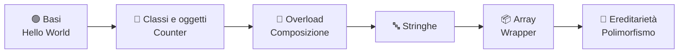

<div align="center">

# ☕ Linguaggi di Programmazione

### Il mio percorso in **Java** durante il corso dell'**Università degli Studi di Ferrara**

[](https://www.oracle.com/java/technologies/downloads/)
[](https://www.unife.it/)
[](#-roadmap)
[](https://github.com/MatteoBeccari05/Linguaggi_di_programmazione/commits/main)
[](https://github.com/MatteoBeccari05/Linguaggi_di_programmazione/stargazers)

*Dall'«Hello World!» al polimorfismo: esercizi, esperimenti e appunti in codice.*

[📂 Struttura](#-struttura-della-repository) •
[🧠 Argomenti](#-argomenti-trattati) •
[🚀 Come eseguire](#-come-compilare-ed-eseguire-il-codice) •
[🗺️ Roadmap](#-roadmap) •
[👤 Autore](#-autore)

</div>

---

## 📖 Introduzione

Questa repository raccoglie tutti i programmi e gli esercizi in **Java** sviluppati durante il corso di **Linguaggi di Programmazione**. Ogni cartella corrisponde a una lezione e aggiunge un tassello al percorso: si parte dalle basi della sintassi e si arriva ai pilastri della **programmazione orientata agli oggetti**.

Può essere utile come:

- 📝 **archivio personale** degli esercizi svolti;
- 🔎 **riferimento rapido** per ripassare un concetto prima dell'esame;
- 🤝 **spunto di confronto** per chi segue lo stesso corso.

> [!NOTE]
> Il codice è scritto a scopo didattico: la priorità è la chiarezza, non l'ottimizzazione.

---

## 📂 Struttura della Repository

<!-- STRUCTURE:START -->

| Cartella | Descrizione | File `.java` |
|----------|-------------|:------------:|
| 📁 [**Lezione_1**](https://github.com/MatteoBeccari05/Linguaggi_di_programmazione/tree/main/Lezione_1) | Concetti introduttivi (Hello World!) | 2 |
| 📁 [**Lezione_2**](https://github.com/MatteoBeccari05/Linguaggi_di_programmazione/tree/main/Lezione_2) | Primi esercizi con classe Counter | 10 |
| 📁 [**Lezione_3**](https://github.com/MatteoBeccari05/Linguaggi_di_programmazione/tree/main/Lezione_3) | Esercizi su overload ed oggetti composti | 5 |
| 📁 [**Lezione_4**](https://github.com/MatteoBeccari05/Linguaggi_di_programmazione/tree/main/Lezione_4) | Esercizi sulle stringhe | 9 |
| 📁 [**Lezione_5**](https://github.com/MatteoBeccari05/Linguaggi_di_programmazione/tree/main/Lezione_5) | Esercizi sugli array e sui wrapper | 11 |
| 📁 [**Lezione_6**](https://github.com/MatteoBeccari05/Linguaggi_di_programmazione/tree/main/Lezione_6) | Esercizi su ereditarietà e polimorfismo | 27 |
| 📁 [**Tutorato**](https://github.com/MatteoBeccari05/Linguaggi_di_programmazione/tree/main/Tutorato) | Esercizi svolti durante i tutorati | 4 |
| 📄 [`somma.java`](https://github.com/MatteoBeccari05/Linguaggi_di_programmazione/blob/main/somma.java) | File nella root | 1 |

> *Tabella generata automaticamente: non modificarla a mano.*

<!-- STRUCTURE:END -->

---

## 🧠 Argomenti trattati



<details>
<summary><b>📌 Clicca per vedere il dettaglio dei concetti</b></summary>

<br>

- **Fondamenti** – struttura di una classe, metodo `main`, compilazione ed esecuzione con `javac` / `java`.
- **Classi e oggetti** – stato e comportamento, costruttori, incapsulamento (esempio guida: `Counter`).
- **Overload e composizione** – più metodi con lo stesso nome ma firme diverse; oggetti che contengono altri oggetti.
- **Stringhe** – gli oggetti `String` e la loro immutabilità, confronto, ricerca, estrazione e trasformazione di testo.
- **Array e wrapper** – collezioni di dimensione fissa, classi involucro (`Integer`, `Double`, …), boxing e unboxing.
- **Ereditarietà e polimorfismo** – riuso del codice con `extends`, ridefinizione dei metodi, selezione dinamica del metodo a runtime.

</details>

---

## 🚀 Come compilare ed eseguire il codice

### ✅ Prerequisiti

- [**JDK**](https://www.oracle.com/java/technologies/downloads/) (Java Development Kit) installato.
  Verifica con:
  ```bash
  java -version
  javac -version
  ```
- [**Git**](https://git-scm.com/) per clonare la repository (facoltativo: puoi anche scaricare lo ZIP da GitHub).

### ⚡ Quick start

```bash
# 1️⃣ Clona la repository
git clone https://github.com/MatteoBeccari05/Linguaggi_di_programmazione.git

# 2️⃣ Entra nella cartella del progetto
cd Linguaggi_di_programmazione

# 3️⃣ Compila un file sorgente
javac somma.java

# 4️⃣ Esegui il programma
java somma
```

### 📁 Eseguire un esercizio di una lezione

```bash
cd Lezione_2
javac *.java        # compila tutti i file della cartella
java NomeClasse     # esegui la classe che contiene il main
```

> [!TIP]
> Se la classe appartiene a un **package** (cioè inizia con `package nome;`), compila e lancia dalla cartella *superiore* al package:
> ```bash
> javac nome/*.java
> java nome.NomeClasse
> ```

> [!WARNING]
> Se il file `.java` è nella root, il nome del file deve coincidere con quello della classe `public` al suo interno. Per questo si usa `javac nome_file.java` e poi `java nome_classe` (**senza** estensione).

### 🛠️ Problemi comuni

| Errore | Causa probabile | Soluzione |
|--------|-----------------|-----------|
| `'javac' non è riconosciuto…` | JDK non installato o non nel `PATH` | Installa il JDK e riavvia il terminale |
| `Error: Could not find or load main class` | Sei nella cartella sbagliata o c'è un package | Controlla la cartella e il nome completo della classe |
| `class X is public, should be declared in a file named X.java` | Nome file ≠ nome classe | Rinomina il file o la classe |

---

## 🗺️ Roadmap

- [x] Lezione 1 – Concetti introduttivi
- [x] Lezione 2 – Classe `Counter`
- [x] Lezione 3 – Overload e oggetti composti
- [x] Lezione 4 – Stringhe
- [x] Lezione 5 – Array e wrapper
- [x] Lezione 6 – Ereditarietà e polimorfismo
- [x] Tutorato 1
- [ ] Prossime lezioni (classi astratte, interfacce, eccezioni, …)
- [ ] Ulteriori tutorati

---

## 🤝 Contribuire

Hai trovato un errore o un modo più elegante di risolvere un esercizio? Sei il benvenuto!

1. Fai un **fork** della repository
2. Crea un branch: `git checkout -b miglioria/nome-esercizio`
3. Fai commit delle modifiche: `git commit -m "Descrizione della modifica"`
4. Fai push: `git push origin miglioria/nome-esercizio`
5. Apri una **Pull Request**

---

## 👤 Autore

<div align="center">

**Matteo Beccari**
Studente presso l'Università degli Studi di Ferrara

[](https://github.com/MatteoBeccari05)

</div>

---

<div align="center">

⭐ **Se questa repository ti è stata utile, lascia una stella!** ⭐

*Fatto con ☕ e tanta pazienza.*

</div>
